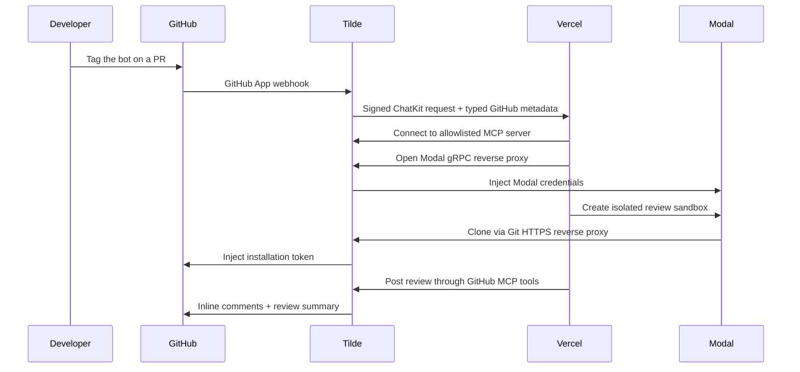

# Code Review Bot

A production-oriented GitHub code review agent built with Next.js, the Vercel
AI SDK, Tilde, and Modal.

Tag the installed GitHub App in a pull request. Tilde turns the GitHub event
into a signed ChatKit message, invokes the Vercel endpoint, exposes an
allowlisted set of GitHub MCP tools, and brokers short-lived access to GitHub
and Modal without giving their long-lived credentials to the model.

## What It Does

- Handles full reviews, incremental reviews, and follow-up questions.
- Reads PR metadata, patches, commits, earlier reviews, and repository guidance.
- Clones the PR through Tilde's Git HTTPS reverse proxy.
- Runs bounded repository-native checks in a request-scoped Modal sandbox.
- Posts P0-P2 inline findings and a structured review summary.
- Verifies GitHub writes by reading the review back before reporting success.
- Expires the sandbox after five minutes of inactivity.

The output follows a stable structure inspired by the public
[Greptile review anatomy](https://www.greptile.com/docs/code-review/first-pr-review):
summary, confidence, findings, validation, and reviewed-commit metadata.

## Architecture



The model never receives a GitHub installation token or Modal API key. The
ephemeral sandbox configures Git once to rewrite GitHub URLs through Tilde and
adds the Tilde proxy headers to its global Git configuration. Sandbox egress is
restricted to Tilde, and the configuration disappears when the sandbox stops.

## Prerequisites

- Node.js 22 or newer and pnpm 10.
- A Tilde account and team.
- A Modal workspace API key.
- A GitHub organization where you can create and install a GitHub App.
- An OpenAI API key.
- A Vercel project for deployment.

## 1. Install

```bash
pnpm install
cp .env.example .env.local
```

## 2. Import Tilde State

Set `CODEX_REVIEW_CHATKIT_ENDPOINT_URL` when importing
[`tilde.state.yaml`](./tilde.state.yaml) to the complete endpoint you intend to use.

[](https://api.trytilde.ai/deploy?repository-url=https%3A%2F%2Fgithub.com%2Ftrytilde%2Fexamples&state-path=code-review-bot%2Ftilde.state.yaml)

For local development, use the public URL from your Tilde development tunnel.

Use the deploy button above, or import the file from Mission Control and provide
the variable when prompted.

The state creates:

- the HTTP/Vercel ChatKit agent;
- pending GitHub and Modal credential setup items;
- GitHub and Modal tool providers;
- a static MCP server containing the GitHub review and Modal inspection
  operations used by this agent.

State cannot contain a GitHub App ID, installation ID, private key, webhook
secret, or generated reverse-proxy profile ID. Those are credential-setup
outputs and must not be committed.

## 3. Complete Credentials

Open **Settings > Team > Pending credentials** in Tilde.

1. Complete GitHub setup. Tilde creates a GitHub App from a manifest, asks
   where to install it, stores its private key and webhook secret, and creates
   GitHub REST and Git HTTPS reverse-proxy profiles.
2. Complete Modal setup with the workspace ID, API key ID, and API key secret.
   Tilde creates the Modal gRPC reverse-proxy profile.
3. In the resulting GitHub ChatKit provider, set **Code Review** as the default
   agent and restrict the repository allowlist for production.

The GitHub App should be installed only on repositories the bot is allowed to
review. Tilde-generated permissions should be reviewed before installation.

## 4. Configure Environment

Use the state import output and the completed provider resources to populate:

| Variable | Value |
| --- | --- |
| `TILDE_API_KEY` | API key output from `chatkit/agent/code-review` |
| `TILDE_WEBHOOK_SIGNING_KEY` | Webhook signing key from the same agent |
| `TILDE_MCP_SERVER_ID` | Persisted ID for `mcp/server/code-review` |
| `TILDE_GITHUB_GIT_PROXY_PROFILE_ID` | Profile using provider `github_git_https` |
| `TILDE_MODAL_PROXY_PROFILE_ID` | Profile using provider `modal_sandbox` |
| `TILDE_ORG_ID` | Organization ID from Team > General information |
| `TILDE_TEAM_ID` | Team ID from Team > General information |

Do not expose these values to client-side Next.js code.

## 5. Run Locally

```bash
pnpm dev
```

Expose port 3000 through the Tilde development tunnel, then set the ChatKit
agent endpoint to:

```text
https://YOUR_TUNNEL/api/code-review
```

Tag the GitHub App in an existing pull request:

```text
@your-app-name review this PR
```

For an explicit complete rerun:

```text
@your-app-name full review
```

Reply to an inline finding and tag the app to ask a follow-up question.

## 6. Deploy to Vercel

Add every value from `.env.example` to the Vercel project. Mark API keys and
signing keys sensitive; IDs, model names, and base URLs do not need to be
secret.

```bash
vercel deploy --prod
```

Update `chatkit/agent/code-review` to the production endpoint and re-import the
state, or edit the endpoint in Mission Control.

The route exports `maxDuration = 300`. Confirm that the selected Vercel plan
supports the required function duration.

## Review Policy

The system prompt deliberately favors precision over comment volume:

- P0: likely security breach, data loss, or systemic outage.
- P1: concrete correctness defect or significant regression.
- P2: actionable medium-impact defect or maintainability problem with a
  demonstrated failure mode.
- P3 and style-only observations are omitted.

The bot uses GitHub's `COMMENT` review event. It does not approve changes or
request changes, so branch protection and human ownership remain intact.

The confidence score is evidence-based rather than a model sentiment score.
Missing tests or failed validation lower confidence even when no defect was
found.

## Production Checklist

- Limit GitHub App installation and the Tilde repository allowlist.
- Keep the MCP server static; do not enable GitHub mutation tools unrelated to
  reviews.
- Configure Git proxy authentication only inside the ephemeral sandbox.
- Use webhook signature verification and reject stale requests.
- Keep sandbox CPU, memory, execution time, output, and idle lifetime bounded.
- Restrict sandbox egress to the configured Tilde reverse-proxy host.
- Do not inject platform credentials into the sandbox.
- Keep request timeout below the hosting platform's hard function limit and
  await idempotent MCP and sandbox cleanup.
- Re-read GitHub state after every write.
- Monitor tool errors, model finish reasons, review duration, and sandbox
  termination failures.
- Pin dependency versions and review updates to Modal's pre-1.0 JavaScript SDK.

## Files

- [`app/api/code-review/route.ts`](./app/api/code-review/route.ts): ChatKit
  endpoint and Vercel AI SDK loop.
- [`lib/code-review/prompt.ts`](./lib/code-review/prompt.ts): review behavior and
  output contract.
- [`lib/code-review/sandbox.ts`](./lib/code-review/sandbox.ts): Modal lifecycle,
  Git proxy setup, and pull-request checkout.
- [`lib/tilde.ts`](./lib/tilde.ts): the single configured Harness SDK client.
- [Tilde Harness SDK](https://github.com/trytilde/harness-sdk): ChatKit, MCP,
  reverse-proxy, and typed provider-context integration.
- [`tilde.state.yaml`](./tilde.state.yaml): portable Tilde resources.

## Limitations

This example reads the current repository for each review. It does not maintain
a persistent whole-codebase graph or learn team preferences from reactions.
Those are distinct systems, not prompt features. Repository instructions and
cross-file source inspection provide useful context without claiming parity
with hosted code-indexing products.

Modal's JavaScript SDK currently marks its underlying gRPC API as unstable.
Pin the SDK and test upgrades before deployment.
