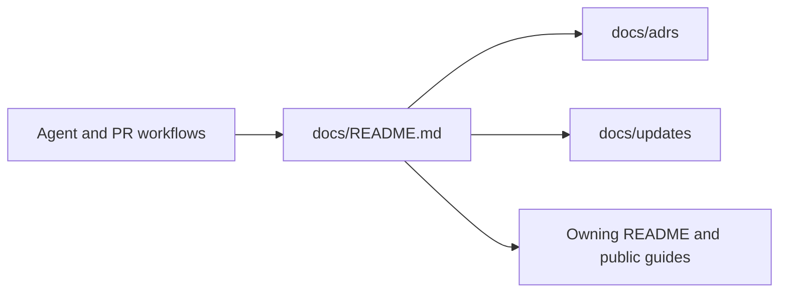

# Consistent documentation and agent workflows

PR: https://github.com/trytilde/examples/pull/21

## Intent of the change

Make durable decisions and complete change records discoverable and consistently
maintained across Tilde repositories throughout implementation and PR review.

## Architecture changes

Governing decision: [0001-repository-documentation-convention](../adrs/0001-repository-documentation-convention.md).
Runtime architecture is unchanged by the documentation-convention changes.

## Summarized changes

- Standardized directories, templates, and documentation maintenance instructions.
- Connected agent instructions and PR, pre-commit, architecture, and documentation skills.
- Preserved existing decision history and repaired moved local references.
- Validation: local Markdown links, balanced code fences, required update sections, changed skill frontmatter, and `git diff --check` passed.
- Prepared from the fetched default branch in an isolated worktree; unrelated checkout changes are excluded.
- Runtime builds and provider/browser flows were not run because this change affects contributor documentation only.
- Published as a draft PR with this record renamed to its verified PR number. No application deployment is required.

## Critical to apply

no

No application migration or secret change is required. Contributors use `docs/adrs`
and the shared update workflow after this change lands. Related repositories adopt
the same convention independently.
